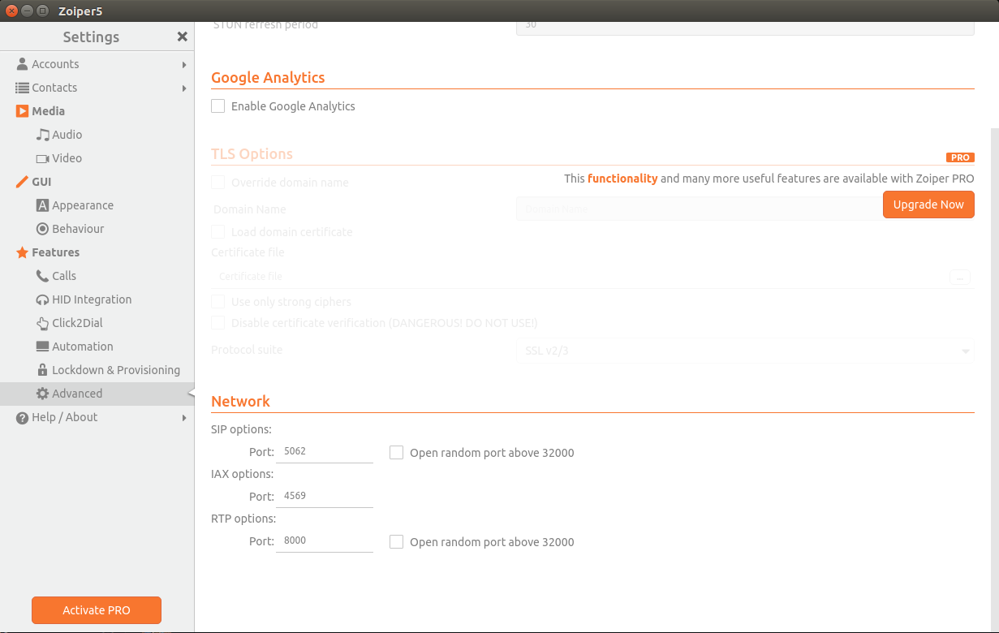

# ExAriExample

This is an Elixir based application to demo the usage of the [ex_ari library](https://github.com/citybaseinc/ex_ari).

 Asterisk has the ability to stream audio files for playback so we provide a basic Cowboy server to host the audio files, you can see the configuration in the [application module](lib/application.ex)

## Asterisk Server

This repo provides a Dockerfile to build an Asterisk server. This demo assumes you are running everything locally, but this same Dockerfile can be used in a live production environment as well.

The base Dockerfile is available in the [Citybase Asterisk repo](https://github.com/CityBaseInc/asterisk) and it's published to Quay [here](https://quay.io/repository/citybaseinc/asterisk)

The Dockerfile in this repo just overrides a few of the settings files. This image is based on [Alpine Asterisk 16.3.0-r2](https://pkgs.alpinelinux.org/package/v3.10/main/x86_64/asterisk)

To build and start the Asterisk server run

	$ docker build . -f Dockerfile.asterisk

The last line of output should contain

	Successfully built 90b51e01b345

Copy `90b51e01b345` **your output should have a different hash.**

and run

	$ docker run --network=host --name asterisk -v $PWD/asterisk_local_config/pjsip.conf:/etc/asterisk/pjsip.conf 90b51e01b345

The output should look like this

      Loading res_manager_presencestate.so.
        == Manager registered action PresenceStateList
        == res_manager_presencestate.so => (Manager Presence State Topic Forwarder)
      [Nov 14 02:09:26] WARNING[1]: loader.c:2381 load_modules: Some non-required modules failed to load.
      [Nov 14 02:09:26] ERROR[1]: loader.c:2396 load_modules: res_pjsip_transport_websocket declined to load.
      [Nov 14 02:09:26] ERROR[1]: loader.c:2396 load_modules: cel_sqlite3_custom declined to load.
      [Nov 14 02:09:26] ERROR[1]: loader.c:2396 load_modules: cdr_sqlite3_custom declined to load.
      [Nov 14 02:09:26] ERROR[1]: loader.c:2396 load_modules: res_hep_rtcp declined to load.
      [Nov 14 02:09:26] ERROR[1]: loader.c:2396 load_modules: res_hep_pjsip declined to load.
      Asterisk Ready.

The errors are expected, as we don't utilize those modules.

Your Asterisk server is now running.

## Environment Variables

We utilize environment variables to help configure the application, we've provided a `default.env` file to get started with. Let's move that to `dev.env` file for local development.

	$ cp default.env dev.env

All the variables in this file are fine for our local test env, but let's go over them to see their relevance

    $ cat dev.env

    export INGRESS_CIDRS=127.0.0.1/32
    export AOR_IPS=127.0.0.1:5062
    export PUBLIC_IP=127.0.0.1
    export ASTERISK_HOSTNAME=test.test.com
    export ASTERISK_USERNAME=ex_ari
    export ASTERISK_PASSWORD=!ex_ari_password!
    export ASTERISK_WS_HOST=ws://127.0.0.1:8088/ari/events
    export ASTERISK_REST_HOST=127.0.0.1
    export ASTERISK_REST_PORT=8088
    export ASTERISK_NAME=ex_ari
    export ASTERISK_TRANSPORT=udp
    export ASTERISK_CONTEXT=ex_ari

### INGRESS_CIDRS
This is used to tell Asterisk what [endpoints](https://blogs.asterisk.org/2018/02/07/identifying-endpoint-pjsip/) to configure

### AOR_IPS
This is used to tell Asterisk what [AORs](https://wiki.asterisk.org/wiki/display/~jcolp/AORs,+Contacts,+Device+State) to configure. If you were using a SIP Trunk to handle your incoming calls, you would set this to be the settings of your provider. The example app will accept multiple ips separated by a comma eg; 54.23.186.111:60039,65.89.123.10:60193

### PUBLIC_IP
This is the publically available IP that SIP requests will address. It should be the same IP that your ASTERISK_HOSTNAME resolves to. It's used to set the `media_address` for the endpoint.

### ASTERISK_HOSTNAME
We have [dnsmgr](https://blogs.asterisk.org/2018/01/10/pjsip-dns-manager-dnsmgr-full-dynamic-hostname-support-coming-soon/) enabled by default, this allows Asterisk to query it's public IP periodically using the hostname provided to provide the IP address for outgoing SIP packets. This ensures our downstream clients send SIP packets back to the correct IP, this is a UDP protocol ;)

### ASTERISK_USERNAME
This is the username configured in [ari.conf](https://github.com/CityBaseInc/ex_ari_example/blob/master/asterisk_config/ari.conf)

### ASTERISK_PASSWORD
This is the password configured for our username above in [ari.conf](https://github.com/CityBaseInc/ex_ari_example/blob/master/asterisk_config/ari.conf)

### ASTERISK_WS_HOST
This is a websocket protocol address pointing to the IP of the Asterisk server and port configured in [http.conf](https://github.com/CityBaseInc/ex_ari_example/blob/master/asterisk_config/http.conf) with the path to the ARI event stream. **You should not expose the http port to the outsied world! In general we run the our elixir apps as "sidecars" with the asterisk server, so they exist on the same machine. It is possible to run them on separate servers, but keeping everything local keeps it fast.**

### ASTERISK_REST_HOST
This is the host to connect to for REST calls, in general it should be you local loopback interface.

### ASTERISK_REST_PORT
This is the port that the Asterisk server binds to. It's configured in [http.conf](https://github.com/CityBaseInc/ex_ari_example/blob/master/asterisk_config/http.conf). **You should not expose the http port to the outsied world! In general we run the our elixir apps as "sidecars" with the asterisk server, so they exist on the same machine. It is possible to run them on separate servers, but keeping everything local keeps it fast.**

### ASTERISK_NAME
This is used for naming your endpoint identify and AOR configuration objects.

### ASTERSISK_TRANSPORT
This is the name of the transport in your [pjsip.conf](https://github.com/CityBaseInc/ex_ari_example/blob/master/asterisk_config/pjsip.conf)

### ASTERISK_CONTEXT
This provides the context name for your Endpoint.

## Elixir Application

Now that we've seen all the different configuration options, let's get our system up and running. The default values are fine for our local env, so let's load them into our environment

  	$ source dev.env

We should still have our Asterisk server running from earlier, if not, restart that in a separate session.

Let's startup our Elixir app

    $ mix deps.get
    $ iex -S mix

You should see quite a bit of logging about configuring the Asterisk server and registering some Stasis applications. It may be worth checking out the Asterisk logs as well. We should see something like this.

    Creating Stasis app 'ex_ari'
     Creating Stasis app 'router'
      == WebSocket connection from '127.0.0.1:47763' for protocol '' accepted using version '13'
      == WebSocket connection from '127.0.0.1:33123' for protocol '' accepted using version '13'
        -- Reloading module 'res_pjsip.so' (Basic SIP resource)
    [Nov 20 21:23:29] ERROR[37]: res_pjsip_config_wizard.c:1080 object_type_loaded_observer: There was no wizard for object type 'aor'
    [Nov 20 21:23:29] WARNING[37]: res_pjsip/config_transport.c:506 transport_apply: Transport 'udp' is not reloadable, maintaining previous values
    [Nov 20 21:23:29] ERROR[37]: res_pjsip_config_wizard.c:1080 object_type_loaded_observer: There was no wizard for object type 'endpoint'
    [Nov 20 21:23:29] ERROR[37]: res_pjsip_config_wizard.c:1080 object_type_loaded_observer: There was no wizard for object type 'identify'
    [Nov 20 21:23:29] NOTICE[37]: sorcery.c:1334 sorcery_object_load: Type 'system' is not reloadable, maintaining previous values
    [Nov 20 21:23:29] ERROR[37]: res_pjsip/config_system.c:261 system_create_resolver_and_set_nameservers: There are no local system nameservers configured, resorting to system resolution
      == Endpoint ex_ari is now Reachable

Ok, everything is configured and up and running. Now we need to be able to make calls to our little IVR system.

## Configure Zoiper

Locally I've been using [Zoiper](https://www.zoiper.com/) to test and make calls locally.

Let's walk through setting that up.

### Add a new Account
Domain will be `127.0.0.1`

### Setup Account Advanced settings

Select the correct DTMF (touch tone) protocol. `DTMF RFC-2833` and Network settings. Note the rport and STUN settings as well.

### Setup Account Codecs

Just select all the available codecs. The important ones for the example application are `G.711 a-law` and `G.711 mu-law`. The example app uses all .wav audio files and Asterisk handles the conversion.

### SIP Options

Above we configured our AOR IPs to our local loopback and the port `5062`, so we need to make sure our VOIP client is calling from the correct ip:port.

## Making a call
Exit out of the settings by selecting the `X` near the "Settings" header.

In the search bar on the Zoiper dialer, enter `+15555555151` or `ex_ari` and hit "enter", those are the 2 extensions we've registered with our Router. You should hear a voice prompt and if you inspect the logs of the Asterisk server and the Elixir application, you should see plenty of logs regarding the incoming call.

Our super basic client listens for the number `1` and the number `2` as touch tone input and stops any ongoing audio and plays back a specific file.

## Wrapping up

Hopefully you were able to get a working Asterisk and ExARI application up and running. Asterisk is an extremely powerful communications server, and the ARI protocol gives us almost complete control over the whole system. I'm excited to see what people build. There's some really cool stuff you can do with WebRTC and video as well which I haven't completely explored, but the ExAri library should be complete and extensible enough to make use of it.

[ExARI](https://github.com/citybaseinc/ex_ari)

Happy hacking!
